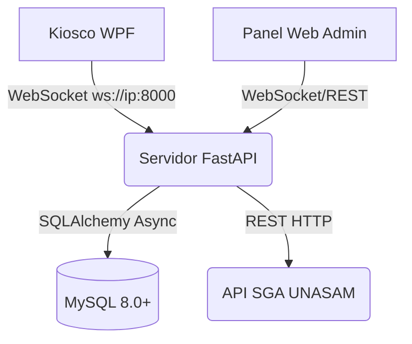
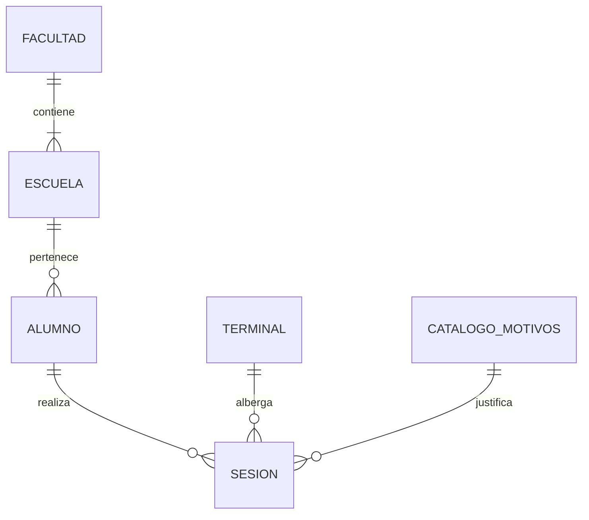
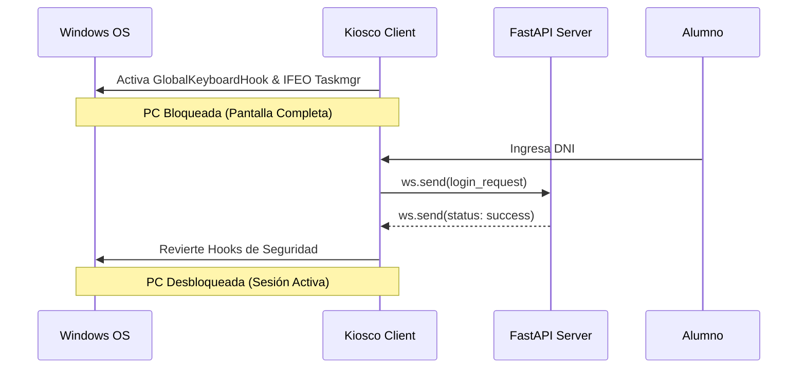
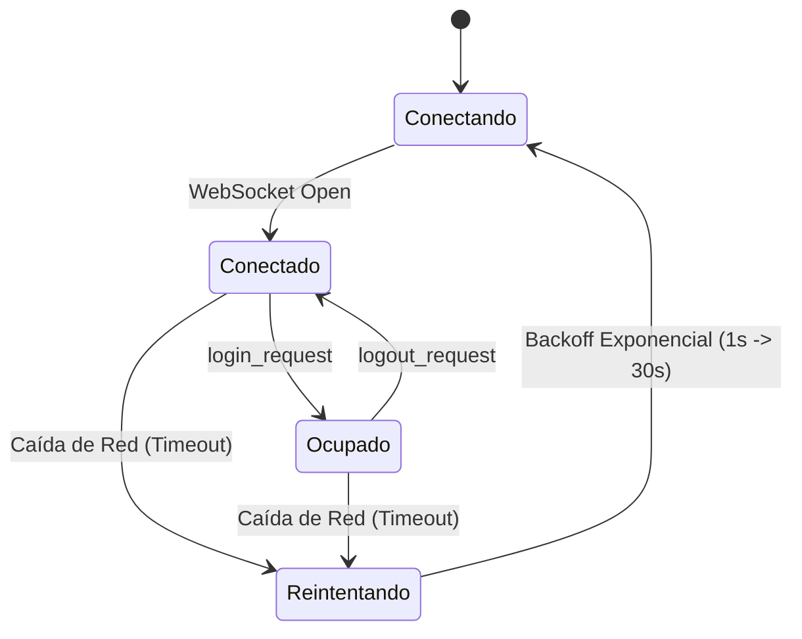

<div align="center">

# 🏫 Sistema de Control de Acceso y Bloqueo de Terminales (v3.0)

[INSERTAR IMAGEN: Banner del Proyecto / Logo Institucional UNASAM]

[](https://www.python.org/)
[](https://learn.microsoft.com/en-us/dotnet/csharp/)
[](https://learn.microsoft.com/en-us/dotnet/desktop/wpf/)
[](https://fastapi.tiangolo.com/)
[](https://developer.mozilla.org/en-US/docs/Web/JavaScript)
[](https://www.mysql.com/)

</div>

## 1. Contexto
Este sistema automatiza el acceso a las computadoras de la Biblioteca Central. Utiliza un **Kiosco (WPF)** que bloquea físicamente la PC hasta que el alumno ingresa su DNI, un **Servidor (FastAPI)** que valida los datos contra la base de datos local y la API del SGA, y un **Panel Web (JS)** que permite al personal administrar las sesiones activas en tiempo real.

**Metodología de Desarrollo:** Enfoque Iterativo e Incremental (fases v1-v3), centrado prioritariamente en la seguridad a nivel de sistema operativo y comunicación de alta disponibilidad.
**Lenguajes Principales:** C# (.NET 8), Python (FastAPI), Vanilla JavaScript y SQL.

### 1.1 Decisiones Técnicas (The "Why")
- **¿Por qué C# WPF y no Web?** El Kiosco debe bloquear comandos nativos del SO (`Alt+Tab`, `Ctrl+Shift+Esc`). Un navegador no tiene acceso a la API Win32 ni a los *Hooks* globales de teclado requeridos.
- **¿Por qué FastAPI con WebSockets?** El dashboard admin necesita ver el estado de +50 terminales en tiempo real sin recargar. `asyncio` permite mantener +50 conexiones persistentes abiertas simultáneamente sin saturar la RAM del servidor.
- **¿Por qué Vanilla JS sin React/Angular?** Para evitar dependencias pesadas y configuración adicional. El HTML se sirve de forma estática directamente desde el backend, simplificando el despliegue local a un solo clic.

---

## 2. Prerequisites (Requisitos Previos)

> [!WARNING]
> **Riesgo en el Sistema Operativo:** Dado que el cliente WPF intercepta el teclado a bajo nivel (Win32 Hooks) y altera el Registro de Windows (IFEO/Taskmgr), **se recomienda encarecidamente probar el cliente en una Máquina Virtual (VM)** antes de compilar para producción.

> [!IMPORTANT]
> **Arquitectura de Red Estática:** El servidor central DEBE tener una IP local estática asignada por el router, de lo contrario los clientes WPF perderán la conexión al reiniciar.

| Módulo | Tecnología Principal | Requisitos de Hardware/Software |
|:---|:---|:---|
| **Servidor Central** | Python 3.12+, MySQL 8.0+ | Windows 10/11 o Server 2019+, Puerto `8000` expuesto en Firewall local. |
| **Cliente Kiosco** | C# .NET 8 (WPF) | Windows 10/11 x64. Ejecución obligatoria con permisos de *Administrador*. |
| **Panel Admin** | Vanilla JavaScript, HTML5 | Navegador web moderno (Chrome/Edge/Firefox). No requiere instalación. |

---

## 3. Step-by-Step / Flujo Lógico

### 3.1 Arquitectura y Comunicación en Tiempo Real
El código prioriza WebSockets sobre REST para lograr tiempos de respuesta milisegundos y visualización en vivo.



[INSERTAR IMAGEN: Fotografía del centro de cómputo mostrando las PCs bloqueadas y el Servidor]

### 3.2 Flujo del Servidor y Base de Datos
El servidor actúa como orquestador central. La base de datos sigue un modelo relacional estricto con un patrón *Upsert* (Insertar o Actualizar) masivo para el padrón de estudiantes.



1. Clonar el repositorio en el servidor.
2. Modificar el archivo local `config.json` ingresando las credenciales de MySQL y el Hash SHA-256 de la contraseña del administrador.
3. Ejecutar `instalar_servidor.bat` para instalar dependencias.
4. Ejecutar `servidor_run.bat`. El sistema creará las tablas MySQL y correrá migraciones automáticamente.

[INSERTAR IMAGEN: Modelo Gráfico Relacional Completo de la Base de Datos (DER)]

### 3.3 Flujo del Cliente (Kiosco WPF)
El cliente está diseñado bajo un modelo *Zero-Trust* hacia el estudiante.



1. Al ejecutarse, la aplicación activa un `GlobalKeyboardHook` e inyecta reglas *IFEO* en el registro para inutilizar `taskmgr.exe`, `Alt+Tab` y `Tecla Win`.
2. La pantalla se maximiza sin bordes (TopMost).
3. El alumno ingresa su DNI. Si es válido, el sistema revierte los bloqueos temporalmente.
4. Si el DNI no existe, se muestra un **Carrusel Informativo Interactivo** indicando que el alumno no está matriculado.

[INSERTAR IMAGEN: Captura de pantalla de la Interfaz Principal de Ingreso del Kiosco]
[INSERTAR IMAGEN: Captura del modal del Carrusel Informativo (Error de DNI)]

### 3.4 Flujo del Administrador (Panel Web)
El panel administra dos roles principales: **Asistente (N1)** y **Administrador (N2)**.

1. Acceder a `http://<ip-servidor>:8000/admin`.
2. **Nivel 1:** Visualiza tarjetas verdes/rojas por cada terminal. Busca en el historial de sesiones y exporta reportes en PDF/Excel.
3. **Nivel 2 (Requiere PIN):** Permite subir archivos Excel `.xlsx` para cargar masivamente miles de estudiantes en segundos.
4. **Nivel 2:** Permite enviar comandos remotos de `Desbloquear PC` o `Forzar Cierre de Sesión` vía WebSocket directamente a las terminales.

[INSERTAR IMAGEN: Captura del Panel de Control Web - Vista en vivo de las terminales]
[INSERTAR IMAGEN: Captura del Panel Web - Módulo de importación de Excel]

### 3.5 Estructura del Proyecto
```text
ControlBiblioteca/
├── admin/               # Frontend Vanilla JS (Panel Web)
│   ├── index.html
│   └── static/css, js/
├── client/              # Cliente Kiosco en C# WPF (.NET 8)
│   ├── ControlBiblioteca.Client.csproj
│   └── UI, Services/
└── server/              # Backend en FastAPI
    ├── main.py          # Punto de entrada y gestión WebSocket
    ├── models.py        # Modelos SQLAlchemy (MySQL)
    └── api, core/
```

### 3.6 Guía Técnica de Despliegue (Comandos)
**Compilar Cliente (C#) para Producción:**
Se usa `--self-contained true` para que el ejecutable incluya el .NET Runtime y corra en cualquier PC sin necesidad de instalaciones previas:
```powershell
dotnet publish client\ControlBiblioteca.Client.csproj -c Release -r win-x64 --self-contained true -p:PublishSingleFile=true
```
[INSERTAR IMAGEN: Consola mostrando la compilación exitosa con dotnet publish]

**Ejecutar Servidor (Python) Manualmente:**
```bash
cd server
python -m venv venv
venv\Scripts\activate
pip install -r requirements.txt
python -m uvicorn main:app --host 0.0.0.0 --port 8000
```
[INSERTAR IMAGEN: Consola del servidor mostrando uvicorn corriendo y WebSockets activos]

### 3.7 Referencia de la API y WebSockets

**Ciclo de Vida de la Conexión Kiosco-Servidor:**


- `GET /api/admin/sesiones`: Retorna el JSON con estadísticas de terminales activas.
- **WebSocket (Kiosco):** Payload enviado al autenticarse:
  ```json
  { "action": "login_request", "dni": "71926257", "motivo_id": 2 }
  ```
- **WebSocket (Admin):** Comando para forzar desbloqueo remoto:
  ```json
  { "action": "force_unlock", "terminal_id": 5, "admin_hash": "a2b4c..." }
  ```
[INSERTAR IMAGEN: Logs de red mostrando el intercambio de JSON por WebSocket]

### 3.8 Casos de Uso
El flujo de negocio principal asegura que los recursos de hardware sean utilizados exclusivamente con fines académicos y registrados correctamente.
[INSERTAR IMAGEN: Diagrama Visual de Casos de Uso del Sistema (Actor: Alumno, Admin, Sistema)]

---

## 4. Expected Results (Resultados Esperados)

Cuando el sistema está desplegado y configurado exitosamente:
- **Seguridad Garantizada:** Las PCs cliente no pueden ser utilizadas por personal no registrado. Apagar la PC o intentar matar el proceso no evade el bloqueo.
- **Sincronización Inmediata:** Si un estudiante se loguea en la "PC-05", el administrador ve la tarjeta de la PC-05 cambiar a rojo en su pantalla en menos de 1 segundo.
- **Trazabilidad:** Se genera un registro inmutable de qué DNI usó qué PC, la hora exacta de inicio/fin y el motivo académico de uso.
- **Sanidad de Datos:** Si el servidor pierde energía repentinamente, las tareas en segundo plano (`asyncio tasks`) detectarán las sesiones "fantasma" al reiniciar y las cerrarán automáticamente.

[INSERTAR IMAGEN: Gráficos estadísticos del panel web generados tras el uso continuo]

---

## 5. Troubleshooting (Solución de Problemas)

A continuación, se describen los errores de despliegue más comunes y sus soluciones:

### Problema 1: El cliente WPF arranca pero se queda en estado "Desconectado" (Texto rojo)
**Causa probable:** El cliente no puede alcanzar el servidor WebSocket o el Firewall de Windows está bloqueando el tráfico.
**Solución:**
1. Verifica que la IP en el `config.json` de la carpeta del cliente (ej. `ws://192.168.1.50:8000/ws`) coincida con la IP actual del servidor.
2. En la PC Servidor, abre el "Firewall de Windows Defender con Seguridad Avanzada" y crea una Regla de Entrada (Inbound Rule) permitiendo conexiones TCP en el puerto `8000`.

[INSERTAR IMAGEN: Captura del error de "Desconectado" en la interfaz del cliente C#]

### Problema 2: El SGA rechaza las peticiones o demora mucho en cargar datos nuevos
**Causa probable:** La API de integración del SGA de la UNASAM está caída o hay latencia extrema.
**Solución:**
1. El sistema tiene un *timeout* configurado (`SGA_TIMEOUT_SECONDS`). Si la API falla, los alumnos que ya estaban importados en el padrón local (MySQL) seguirán pudiendo ingresar normalmente.
2. Para nuevos ingresos de emergencia, utiliza el botón "➕ Nuevo Usuario" en el Panel de Administrador (Nivel 2) para registrar temporalmente al estudiante de forma manual.

> [!TIP]
> Si una PC cliente sufre un pantallazo azul (BSOD) mientras estaba bloqueada, el Administrador de Tareas podría quedar deshabilitado en Windows. Para solucionarlo rápidamente sin formatear, ejecuta la aplicación cliente y usa el "Desbloqueo remoto" desde el Panel Web para que el software restaure los registros automáticamente.
