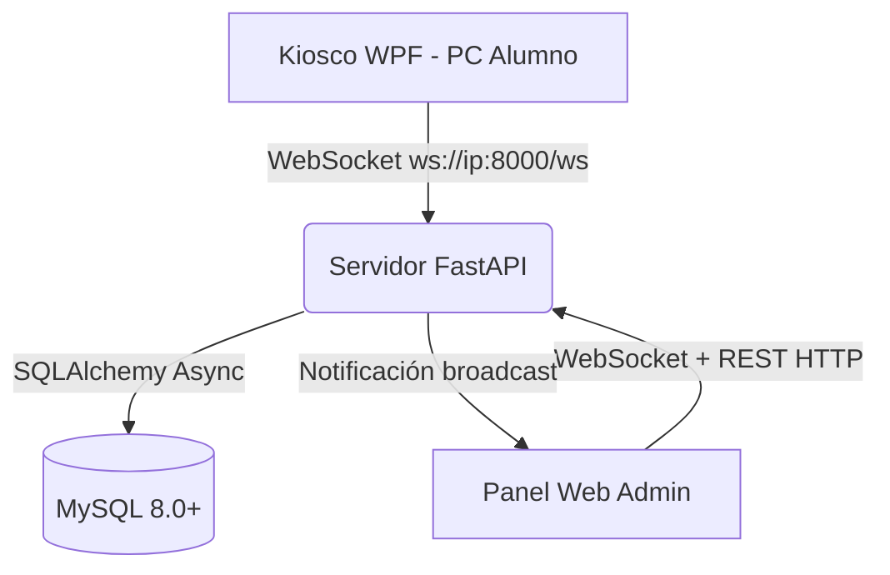
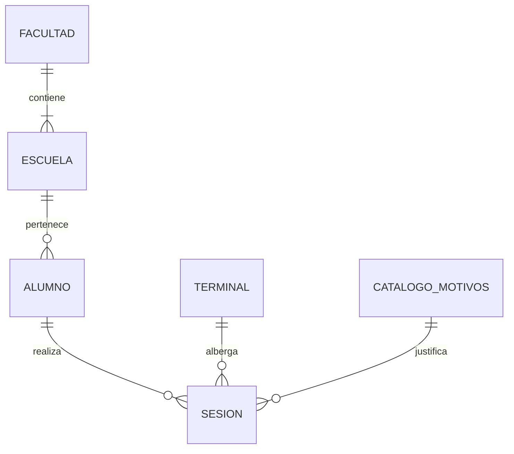
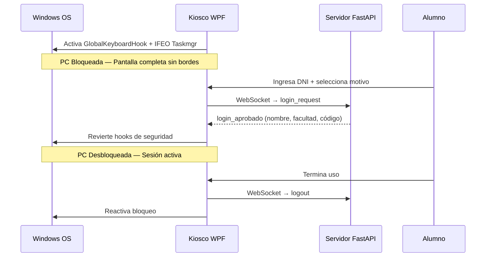
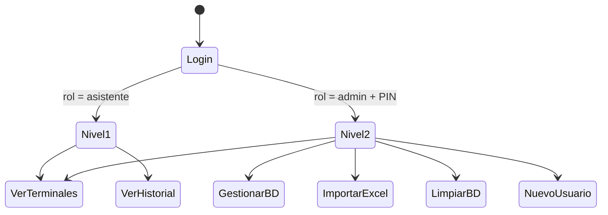
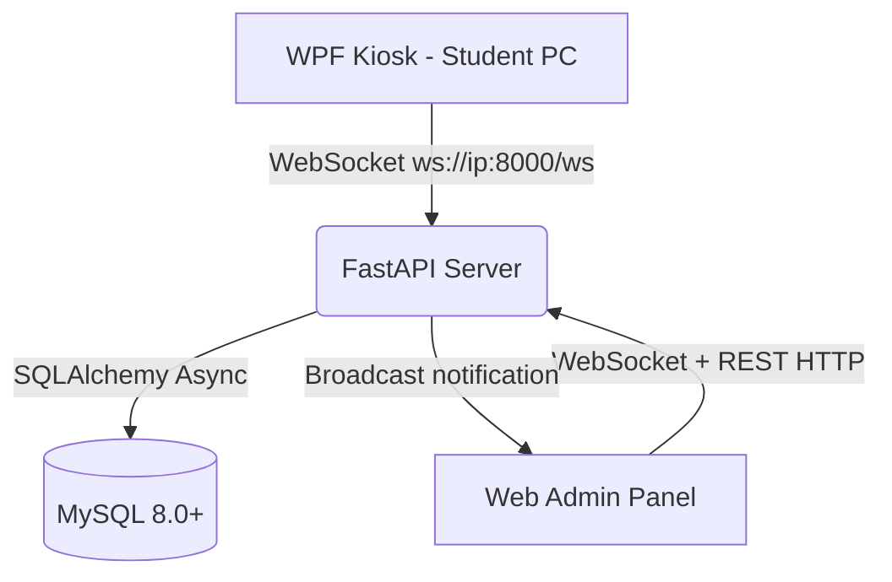
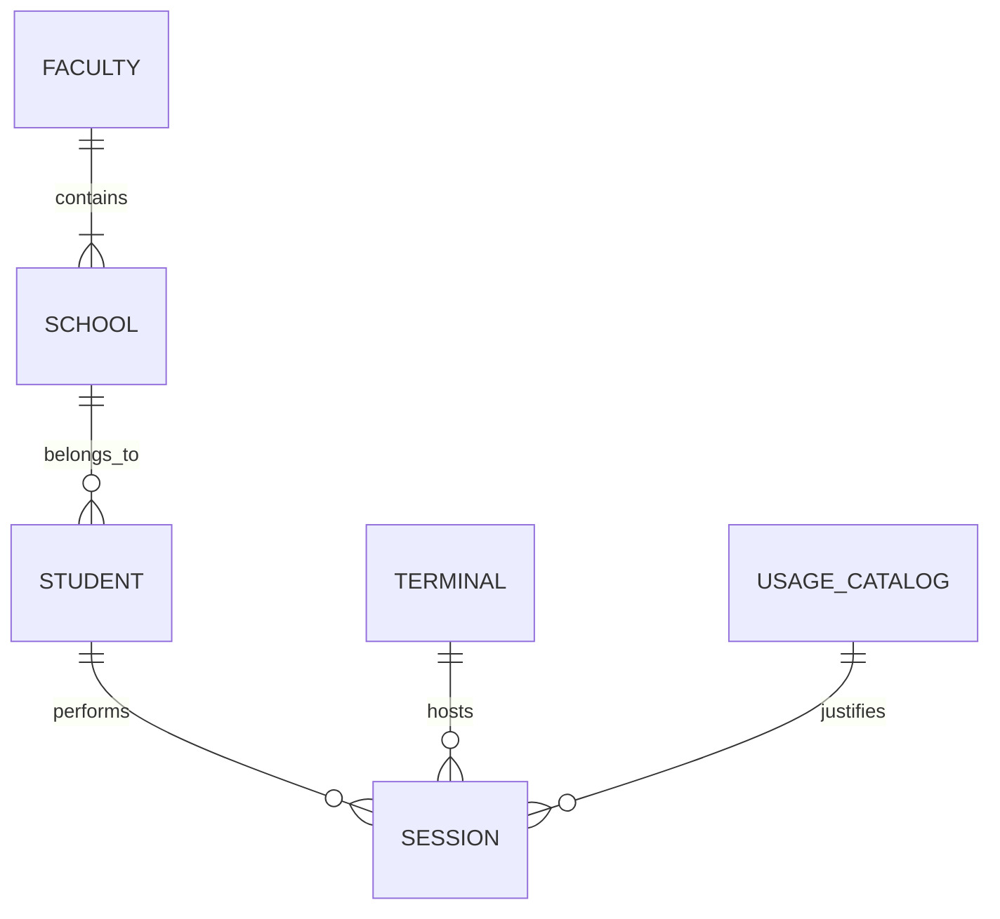
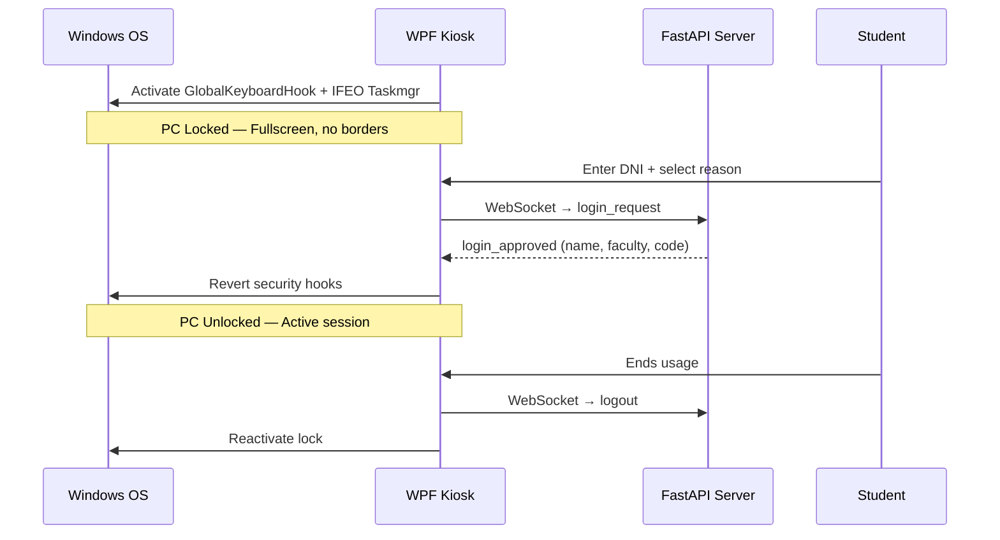

<div align="center">

# 🏫 Sistema de Control de Acceso y Bloqueo de Terminales (v3.0)

[INSERTAR IMAGEN: Banner del Proyecto / Logo Institucional UNASAM]

[](https://www.python.org/)
[](https://learn.microsoft.com/en-us/dotnet/csharp/)
[](https://learn.microsoft.com/en-us/dotnet/desktop/wpf/)
[](https://fastapi.tiangolo.com/)
[](https://developer.mozilla.org/en-US/docs/Web/JavaScript)
[](https://www.mysql.com/)

**🌐 Idioma / Language:**
[🇵🇪 Español](#-español) · [🇺🇸 English](#-english)

</div>

---

# 🇵🇪 Español

## Tabla de Contenidos
1. [Contexto](#1-contexto)
2. [Requisitos Previos](#2-requisitos-previos)
3. [Flujo Lógico del Sistema](#3-flujo-lógico-del-sistema)
4. [Base de Datos](#4-base-de-datos)
5. [Protocolo WebSocket](#5-protocolo-websocket)
6. [Panel de Administración](#6-panel-de-administración)
7. [Cliente Kiosco](#7-cliente-kiosco)
8. [Guía de Despliegue](#8-guía-de-despliegue)
9. [Actualización en Producción](#9-actualización-en-producción)
10. [Historial de Versiones](#10-historial-de-versiones)
11. [Solución de Problemas](#11-solución-de-problemas)

---

## 1. Contexto

Este sistema automatiza el control de acceso a las computadoras de la **Biblioteca Central / Centro de Cómputo de la UNASAM**. Fue desarrollado en tres versiones iterativas (v1 → v3) con enfoque prioritario en seguridad a nivel de sistema operativo y comunicación de alta disponibilidad.

### ¿Qué hace el sistema?

- **Bloquea físicamente cada PC** hasta que un alumno registrado ingrese su DNI
- **Valida en tiempo real** contra la base de datos local del centro
- **Registra automáticamente** cada sesión: quién usó qué PC, cuándo y por cuánto tiempo
- **Permite al personal** administrar todo desde un panel web sin instalar nada adicional
- **Importa masivamente** el padrón de alumnos desde archivos Excel (.xlsx)
- **Exporta reportes** en Excel y PDF con historial completo de sesiones

### Decisiones Técnicas

| Decisión | Razón |
|----------|-------|
| **C# WPF** en vez de app web | El kiosco necesita interceptar `Alt+Tab`, `Win`, `Ctrl+Alt+Del` — imposible desde un navegador sin acceso a la API Win32 |
| **FastAPI + WebSockets** en vez de REST puro | El panel admin necesita ver 28+ terminales en tiempo real sin recargar la página; `asyncio` mantiene todas las conexiones simultáneas sin saturar RAM |
| **Vanilla JS** en vez de React/Angular | Cero dependencias externas, el HTML se sirve directamente desde el backend — despliegue en un solo clic |
| **MySQL** en producción / **SQLite** en desarrollo | MySQL para robustez en producción; SQLite para desarrollo sin instalar nada |
| **PublishSingleFile** en .NET 8 | El `.exe` incluye el runtime completo — no requiere instalar .NET en las PCs cliente |

---

## 2. Requisitos Previos

> [!WARNING]
> **Riesgo en el Sistema Operativo:** El cliente WPF intercepta el teclado a bajo nivel (Win32 Hooks) y modifica el Registro de Windows (IFEO/Taskmgr). Se recomienda probar en una Máquina Virtual antes de desplegar en producción.

> [!IMPORTANT]
> **IP Estática Obligatoria:** El servidor DEBE tener una IP local fija asignada por el router. Si la IP cambia, todos los clientes WPF perderán la conexión al reiniciar.

| Módulo | Tecnología | Versión | Requisitos |
|--------|-----------|---------|-----------|
| **Servidor** | Python + FastAPI | 3.12+ / 0.115.0 | Windows 10/11 o Server 2019+, Puerto 8000 abierto en Firewall |
| **Base de Datos** | MySQL | 8.0+ | Credenciales configuradas en `config.json` |
| **Cliente Kiosco** | C# .NET 8 WPF | .NET 8.0 | Windows 10/11 x64, ejecutar como **Administrador** |
| **Panel Admin** | HTML5 + Vanilla JS | — | Cualquier navegador moderno (Chrome/Edge/Firefox) |

---

## 3. Flujo Lógico del Sistema

### 3.1 Arquitectura General



[INSERTAR IMAGEN: Fotografía del centro de cómputo mostrando las PCs bloqueadas y el servidor]

### 3.2 Flujo del Servidor y Base de Datos



El servidor actúa como **orquestador central**. Al arrancar:
1. Crea las tablas en MySQL si no existen (SQLAlchemy `create_all`)
2. Registra cada terminal cliente que se conecta por WebSocket
3. Mantiene el estado en tiempo real de cada sesión activa
4. Notifica en broadcast a todos los admins conectados ante cualquier cambio

[INSERTAR IMAGEN: Modelo relacional completo de la base de datos (DER)]

### 3.3 Flujo del Cliente Kiosco

El cliente está diseñado bajo un modelo **Zero-Trust** hacia el estudiante.



**Mecanismos de bloqueo activos:**

| Mecanismo | Implementación |
|-----------|---------------|
| Bloquear `Win`, `Alt+Tab` | `SetWindowsHookEx(WH_KEYBOARD_LL)` vía P/Invoke |
| Bloquear Task Manager | Inyección IFEO en registro de Windows |
| Pantalla completa sin bordes | `WindowStyle=None`, `Topmost=True`, `WindowState=Maximized` |
| Bloquear `Alt+F4` | Captura y cancela el evento de cierre |
| Reconexión automática | Backoff exponencial: 2s → 4s → 8s → máx 30s |

[INSERTAR IMAGEN: Captura de la interfaz de ingreso del kiosco en una PC real]

### 3.4 Flujo del Panel de Administración



[INSERTAR IMAGEN: Captura del panel web mostrando terminales activas en tiempo real]

### 3.5 Flujo de Importación Excel

El importador detecta automáticamente las columnas por su **título** (no por posición), por lo que el orden de columnas en el Excel no importa.

| Título detectado | Campo en BD | Limpieza automática |
|-----------------|------------|---------------------|
| DNI, Documento | `dni` | Elimina espacios, toma 8 dígitos |
| Nombres, Nombre | `nombre` | Trim |
| Código, Matrícula | `codigo` | `NULL` si vacío |
| Facultad | `facultad` | Elimina puntos, mayúsculas |
| Escuela, Carrera | `escuela` | Elimina puntos, mayúsculas |

**Comportamiento Upsert:** Si el DNI ya existe → actualiza. Si no existe → inserta.

[INSERTAR IMAGEN: Captura del módulo de importación Excel con barra de progreso]

### 3.6 Estructura del Proyecto

```text
control/
├── server/                      # Backend Python / FastAPI
│   ├── main.py                  # Punto de entrada, WebSocket handler
│   ├── models.py                # Modelos SQLAlchemy (7 tablas)
│   ├── database.py              # Engine async, sesiones
│   ├── auth_service.py          # Verificación de credenciales admin
│   ├── configurador.py          # Lectura/escritura config.json
│   ├── config.json              # ⚠️ NO subir a git (contraseñas)
│   ├── instalar_servidor.bat    # Instalador automático (.venv + deps)
│   ├── servidor_run.bat         # Inicia uvicorn
│   ├── lanzador_invisible.vbs   # Inicia uvicorn sin ventana visible
│   ├── migracion_codigo.sql     # Migración v3 (ejecutar una sola vez)
│   ├── api/
│   │   └── endpoints.py         # Todos los endpoints REST (/api/...)
│   └── core/
│       ├── connection_manager.py # Gestión WebSocket activas
│       └── koha_connector.py    # Conector API SGA UNASAM
│
├── admin/                       # Panel Web (SPA)
│   ├── index.html               # Interfaz completa del panel admin
│   └── static/
│       ├── css/style.css        # Dark theme + glassmorphism
│       └── js/app.js            # Toda la lógica del panel
│
├── client/                      # Cliente Kiosco C# / .NET 8
│   ├── ControlBiblioteca.Client.csproj
│   ├── UI/
│   │   ├── MainWindow.xaml      # Interfaz del kiosco
│   │   └── MainWindow.xaml.cs   # Lógica (WebSocket, bloqueo, carrusel)
│   ├── Services/
│   │   ├── WebSocketService.cs  # Cliente WS con reconexión
│   │   ├── KeyboardHook.cs      # Hook global de teclado
│   │   └── SecurityManager.cs   # Bloqueo de sistema
│   └── images/
│       ├── biblioteca.png       # Fondo de pantalla del kiosco
│       ├── comunicado_1.jpg     # Imagen 1 del carrusel informativo
│       └── comunicado_2.jpg     # Imagen 2 del carrusel informativo
│
└── publish/client/
    └── ControlBiblioteca.Client.exe  # Ejecutable final (self-contained)
```

---

## 4. Base de Datos

### Tablas del Sistema

| Tabla | Descripción | Registros típicos |
|-------|-------------|------------------|
| `alumnos_maestro` | Padrón de estudiantes registrados | 500–5000 |
| `facultades` | Catálogo de facultades | 10–20 |
| `escuelas` | Catálogo de escuelas/carreras | 30–80 |
| `terminales` | PCs registradas en el sistema | 10–50 |
| `catalogo_motivos` | Razones de uso configurables | 5–15 |
| `sesiones` | Historial completo de accesos | Crecimiento continuo |
| `usuarios` | Cuentas admin/asistente del panel | 2–10 |

### Terminal Especial: IMPORTADO

Cuando se carga historial desde Excel, las sesiones históricas se asignan a una terminal virtual llamada **IMPORTADO** (IP: `0.0.0.0`). Esta terminal nunca tiene conexión WebSocket real — solo preserva el historial importado sin contaminarlo con sesiones en vivo.

### Migración v3 (ejecutar una sola vez al actualizar desde v1/v2)

```sql
-- Corregir DNIs copiados incorrectamente al campo codigo
UPDATE alumnos_maestro SET codigo = NULL WHERE codigo = dni;

-- Limpiar puntos al final de nombres de facultades y escuelas
UPDATE facultades SET nombre = REPLACE(nombre, '.', '') WHERE nombre LIKE '%.%';
UPDATE escuelas  SET nombre = REPLACE(nombre, '.', '') WHERE nombre LIKE '%.%';
```

---

## 5. Protocolo WebSocket

### Mensajes Cliente → Servidor

```json
// Registro inicial de terminal
{ "tipo": "hello", "nombre": "PC-01", "ip": "192.168.1.101" }

// Solicitud de login
{ "tipo": "login_request", "dni": "12345678", "codigo_acceso": "U2024001", "motivo_id": 3 }

// Cierre de sesión
{ "tipo": "logout", "dni": "12345678" }

// Señal de vida (cada 30 segundos)
{ "tipo": "heartbeat" }
```

### Mensajes Servidor → Cliente

```json
// Bienvenida con catálogo de motivos
{ "tipo": "bienvenida", "motivos": [{"id": 1, "nombre": "Tarea"}, ...] }

// Login aprobado
{ "tipo": "login_aprobado", "nombre": "Juan Pérez", "facultad": "FCM", "codigo": "U2024001" }

// Login rechazado
{ "tipo": "login_rechazado", "motivo": "DNI no registrado en el sistema" }

// Comando remoto del admin
{ "tipo": "desbloquear" }

// Confirmación heartbeat
{ "tipo": "heartbeat_ack" }
```

> **Protección de WebSocket:** Todo el bloque `login_request` está envuelto en try/except. Cualquier error interno (BD, FK violation, etc.) envía `login_rechazado` y **mantiene la conexión activa** — el cliente nunca se desconecta por un error del servidor.

---

## 6. Panel de Administración

Acceso: `http://<ip-servidor>:8000/admin/`

### Roles y Permisos

| Acción | Nivel 1 (Asistente) | Nivel 2 (Admin) |
|--------|-------------------|----------------|
| Ver terminales en tiempo real | ✅ | ✅ |
| Ver historial de sesiones | ✅ | ✅ |
| Ver estadísticas | ✅ | ✅ |
| Exportar Excel / PDF | ✅ | ✅ |
| Desbloquear / forzar logout de PC | ❌ | ✅ |
| Importar alumnos desde Excel | ❌ | ✅ |
| Agregar alumno manualmente | ❌ | ✅ |
| Editar datos de alumno | ❌ | ✅ |
| Limpiar base de datos | ❌ | ✅ |
| Ver terminal IMPORTADO | ❌ | ✅ |

### Verificación de Contraseña Nivel 2

La contraseña **nunca viaja por la red**:
1. El usuario escribe la contraseña en el navegador
2. JS calcula `SHA-256(contraseña)` localmente
3. El hash se compara en el servidor con `admin_password_hash` del `config.json`

### Historial de Sesiones — Columnas

| Columna | Descripción |
|---------|-------------|
| **PC** | Terminal donde ocurrió la sesión (PC01, PC15, IMPORTADO) |
| **Estudiante** | Nombre completo del alumno |
| **DNI** | Documento de identidad |
| **Facultad** | Facultad del alumno |
| **Escuela** | Escuela/carrera del alumno |
| **Actividad** | Motivo de uso declarado |
| **Inicio** | Hora de inicio de sesión |
| **Salida** | Hora de fin (o "En curso...") |
| **Fecha** | Fecha de la sesión |
| **Estado** | Activa / Cerrada |

[INSERTAR IMAGEN: Captura del historial de sesiones con la columna PC correctamente poblada]

---

## 7. Cliente Kiosco

### Carrusel de Comunicado Informativo

Si el servidor responde "Usuario no registrado", se muestra automáticamente un carrusel de imágenes:

- Panel glassmorphism: **1800×1100px** (optimizado para pantallas 2560×1440)
- 2 imágenes embebidas directamente en el `.exe` (`comunicado_1.jpg`, `comunicado_2.jpg`)
- Navegación con flechas y puntos indicadores
- Se cierra con botón "Cerrar Comunicado"
- Las imágenes **no requieren archivos externos** — están compiladas dentro del ejecutable

[INSERTAR IMAGEN: Captura del carrusel informativo mostrando una imagen de comunicado]

### ComboBox de Motivos

El ComboBox arranca con **"— Seleccionar razón —"** como opción por defecto (deshabilitada). El botón **Ingresar** permanece inactivo hasta que el alumno elija un motivo real. Esto evita que todos marquen "Investigación" por inercia.

---

## 8. Guía de Despliegue

### Instalación del Servidor

```bash
# 1. Copiar carpeta server/ al servidor
# 2. Editar config.json con credenciales MySQL
# 3. Instalar dependencias
instalar_servidor.bat

# 4. Iniciar servidor
servidor_run.bat

# 5. Verificar
# Abrir: http://localhost:8000/admin/
```

### Compilar Cliente para Producción

```powershell
dotnet publish client\ControlBiblioteca.Client.csproj `
  -c Release -r win-x64 `
  --self-contained true `
  -p:PublishSingleFile=true `
  -p:PublishReadyToRun=true `
  -p:IncludeNativeLibrariesForSelfExtract=true `
  -o publish\client
```

[INSERTAR IMAGEN: Consola mostrando compilación exitosa con dotnet publish]

### config.json del Servidor

```json
{
  "db_tipo": "mysql",
  "db_host": "localhost",
  "db_puerto": 3306,
  "db_nombre": "biblioteca",
  "db_usuario": "root",
  "db_password": "tu_password",
  "admin_password_hash": "<SHA-256 de la contraseña Nivel 2>"
}
```

### config.json del Cliente

```json
{
  "servidor_url": "ws://192.168.1.100:8000/ws",
  "nombre_terminal": "PC-01"
}
```

---

## 9. Actualización en Producción

> ⚠️ **Nunca se necesita tocar la base de datos al actualizar.**

### Archivos a reemplazar

```
server\main.py
server\models.py
server\database.py
server\auth_service.py
server\configurador.py
server\api\endpoints.py
server\core\websocket_manager.py
server\core\koha_connector.py
admin\              ← toda la carpeta completa
```

### Archivos que NO se tocan

```
server\config.json       ← contraseñas e IP del servidor
server\.venv\            ← dependencias Python instaladas
biblioteca.db / MySQL    ← todos los datos históricos
```

### Pasos

```
1. Detener uvicorn (Ctrl+C o terminar python.exe en el Administrador de Tareas)
2. Copiar los archivos nuevos encima de los existentes
3. Iniciar: servidor_run.bat
4. Verificar: http://localhost:8000/admin/
5. Recargar navegador admin con Ctrl+Shift+R (limpia caché del JS)
```

---

## 10. Historial de Versiones

### v3.0 (Actual — Mayo 2026)
- Carrusel de comunicado informativo para alumnos no registrados
- Columna **PC** en historial de sesiones, Excel y PDF
- Botón "➕ Nuevo Usuario" para registro manual desde el panel
- Botón "🗑️ Limpiar Base de Datos" con doble confirmación por contraseña (N2)
- Edición de facultad y escuela de alumnos desde el panel
- ComboBox de motivos con placeholder "— Seleccionar razón —"
- Terminal IMPORTADO visible solo para Nivel 2
- WebSocket protegido con try/except — nunca se desconecta por error interno
- Panel del carrusel redimensionado a 1800×1100 para pantallas QHD (2560×1440)
- Importador Excel detecta columnas por título (orden no importa)

### v2.0
- Panel de administración web con roles (asistente / admin)
- Importación masiva desde Excel con upsert por DNI
- Historial de sesiones importadas (terminal IMPORTADO)
- Catálogo de motivos de uso configurable desde el panel
- Exportación a Excel y PDF con filtros

### v1.0
- Sistema base de control de acceso por DNI
- Cliente WPF con bloqueo de teclado y pantalla completa
- Servidor FastAPI con WebSocket
- Base de datos SQLite

---

## 11. Solución de Problemas

### El kiosco muestra "Desconectado" en rojo
**Causa:** El cliente no puede alcanzar el servidor o el firewall bloquea el puerto 8000.
**Solución:**
1. Verificar que la IP en `config.json` del cliente coincida con la IP real del servidor
2. En el servidor: Firewall de Windows → Nueva regla de entrada → Puerto TCP 8000

### Las imágenes del carrusel no aparecen
**Causa:** Las imágenes no fueron incluidas en el proyecto al compilar.
**Solución:** Verificar que `client/images/comunicado_1.jpg` y `comunicado_2.jpg` existan antes de ejecutar `dotnet publish`.

### El historial no muestra la columna PC correctamente
**Causa:** El navegador tiene caché del `app.js` anterior.
**Solución:** Recargar con `Ctrl+Shift+R` en el navegador del administrador.

### El servidor no arranca después de actualizar
**Causa:** El `config.json` fue sobreescrito accidentalmente.
**Solución:** Restaurar el `config.json` original del servidor (tiene las credenciales de MySQL).

### Task Manager deshabilitado después de un crash
**Causa:** El cliente WPF se cerró forzosamente sin revertir los hooks del registro.
**Solución:** Ejecutar el cliente normalmente y usar "Desbloqueo remoto" desde el panel web para que el software restaure el registro automáticamente.

> [!TIP]
> Si una PC cliente sufre pantalla azul (BSOD) con el kiosco activo, el Task Manager puede quedar deshabilitado. Ejecutar el `.exe` nuevamente y usar el desbloqueo remoto desde el panel resuelve el problema sin necesidad de formatear.

---
---

# 🇺🇸 English

## Table of Contents
1. [Context](#1-context)
2. [Prerequisites](#2-prerequisites)
3. [System Logic Flow](#3-system-logic-flow)
4. [Database](#4-database)
5. [WebSocket Protocol](#5-websocket-protocol)
6. [Admin Panel](#6-admin-panel)
7. [Kiosk Client](#7-kiosk-client)
8. [Deployment Guide](#8-deployment-guide)
9. [Production Updates](#9-production-updates)
10. [Version History](#10-version-history)
11. [Troubleshooting](#11-troubleshooting)

---

## 1. Context

This system automates access control to computers at the **Central Library / Computer Center of UNASAM** (National University of Santiago Antúnez de Mayolo, Peru). It was developed across three iterative versions (v1 → v3) with a primary focus on OS-level security and high-availability communication.

### What does it do?

- **Physically locks each PC** until a registered student enters their DNI (national ID)
- **Validates in real time** against the center's local database
- **Automatically records** every session: who used which PC, when, and for how long
- **Allows staff** to manage everything from a web panel with no additional software
- **Mass-imports** student records from Excel files (.xlsx)
- **Exports reports** in Excel and PDF with full session history

### Technical Decisions

| Decision | Reason |
|----------|--------|
| **C# WPF** instead of a web app | The kiosk must intercept `Alt+Tab`, `Win`, `Ctrl+Alt+Del` — impossible from a browser without Win32 API access |
| **FastAPI + WebSockets** instead of pure REST | The admin panel needs to see 28+ terminals in real time without page reloads; `asyncio` handles all concurrent connections without saturating RAM |
| **Vanilla JS** instead of React/Angular | Zero external dependencies; HTML is served directly from the backend — single-click deployment |
| **MySQL** in production / **SQLite** in dev | MySQL for production robustness; SQLite for development with no setup |
| **.NET 8 PublishSingleFile** | The `.exe` includes the full runtime — no .NET installation required on client PCs |

---

## 2. Prerequisites

> [!WARNING]
> **OS-Level Risk:** The WPF client intercepts keyboard input at a low level (Win32 Hooks) and modifies the Windows Registry (IFEO/Taskmgr). Testing in a Virtual Machine before production deployment is strongly recommended.

> [!IMPORTANT]
> **Static IP Required:** The server MUST have a fixed local IP assigned by the router. If the IP changes, all WPF clients will lose their connection on restart.

| Module | Technology | Version | Requirements |
|--------|-----------|---------|-------------|
| **Server** | Python + FastAPI | 3.12+ / 0.115.0 | Windows 10/11 or Server 2019+, Port 8000 open in Firewall |
| **Database** | MySQL | 8.0+ | Credentials configured in `config.json` |
| **Kiosk Client** | C# .NET 8 WPF | .NET 8.0 | Windows 10/11 x64, must run as **Administrator** |
| **Admin Panel** | HTML5 + Vanilla JS | — | Any modern browser (Chrome/Edge/Firefox) |

---

## 3. System Logic Flow

### 3.1 General Architecture



### 3.2 Server and Database Flow



The server acts as the **central orchestrator**. On startup:
1. Creates MySQL tables if they don't exist
2. Registers each client terminal that connects via WebSocket
3. Maintains real-time state of every active session
4. Broadcasts to all connected admins on any state change

### 3.3 Kiosk Client Flow



**Active locking mechanisms:**

| Mechanism | Implementation |
|-----------|---------------|
| Block `Win`, `Alt+Tab` | `SetWindowsHookEx(WH_KEYBOARD_LL)` via P/Invoke |
| Block Task Manager | IFEO injection in Windows Registry |
| Fullscreen borderless | `WindowStyle=None`, `Topmost=True`, `WindowState=Maximized` |
| Block `Alt+F4` | Captures and cancels close event |
| Auto-reconnect | Exponential backoff: 2s → 4s → 8s → max 30s |

### 3.4 Project Structure

```text
control/
├── server/                      # Python / FastAPI Backend
│   ├── main.py                  # Entry point, WebSocket handler
│   ├── models.py                # SQLAlchemy models (7 tables)
│   ├── database.py              # Async engine, sessions
│   ├── auth_service.py          # Admin credential verification
│   ├── configurador.py          # config.json read/write
│   ├── config.json              # ⚠️ DO NOT commit (passwords)
│   ├── instalar_servidor.bat    # Auto-installer (.venv + deps)
│   ├── servidor_run.bat         # Start uvicorn
│   ├── lanzador_invisible.vbs   # Start uvicorn without visible window
│   ├── migracion_codigo.sql     # v3 migration (run once)
│   ├── api/
│   │   └── endpoints.py         # All REST endpoints (/api/...)
│   └── core/
│       ├── connection_manager.py # Active WebSocket management
│       └── koha_connector.py    # UNASAM SGA API connector
│
├── admin/                       # Web Panel (SPA)
│   ├── index.html               # Full admin panel interface
│   └── static/
│       ├── css/style.css        # Dark theme + glassmorphism
│       └── js/app.js            # All panel logic
│
├── client/                      # C# / .NET 8 Kiosk Client
│   ├── ControlBiblioteca.Client.csproj
│   ├── UI/
│   │   ├── MainWindow.xaml      # Kiosk interface
│   │   └── MainWindow.xaml.cs   # Logic (WebSocket, lock, carousel)
│   ├── Services/
│   │   ├── WebSocketService.cs  # WS client with reconnection
│   │   ├── KeyboardHook.cs      # Global keyboard hook
│   │   └── SecurityManager.cs   # System lockdown
│   └── images/
│       ├── biblioteca.png       # Kiosk wallpaper
│       ├── comunicado_1.jpg     # Informational carousel image 1
│       └── comunicado_2.jpg     # Informational carousel image 2
│
└── publish/client/
    └── ControlBiblioteca.Client.exe  # Final executable (self-contained)
```

---

## 4. Database

### System Tables

| Table | Description |
|-------|-------------|
| `alumnos_maestro` | Registered student roster |
| `facultades` | Faculty catalog |
| `escuelas` | School/major catalog |
| `terminales` | Registered PCs in the system |
| `catalogo_motivos` | Configurable usage reasons |
| `sesiones` | Full access history |
| `usuarios` | Admin/assistant panel accounts |

### Special Terminal: IMPORTADO

When loading historical data from Excel, sessions are assigned to a virtual terminal called **IMPORTADO** (IP: `0.0.0.0`). This terminal never has a real WebSocket connection — it only preserves imported history without contaminating live sessions.

---

## 5. WebSocket Protocol

### Client → Server Messages

```json
{ "tipo": "hello", "nombre": "PC-01", "ip": "192.168.1.101" }
{ "tipo": "login_request", "dni": "12345678", "codigo_acceso": "U2024001", "motivo_id": 3 }
{ "tipo": "logout", "dni": "12345678" }
{ "tipo": "heartbeat" }
```

### Server → Client Messages

```json
{ "tipo": "bienvenida", "motivos": [{"id": 1, "nombre": "Tarea"}, ...] }
{ "tipo": "login_aprobado", "nombre": "Juan Pérez", "facultad": "FCM", "codigo": "U2024001" }
{ "tipo": "login_rechazado", "motivo": "DNI not registered in the system" }
{ "tipo": "desbloquear" }
{ "tipo": "heartbeat_ack" }
```

---

## 6. Admin Panel

Access: `http://<server-ip>:8000/admin/`

### Roles and Permissions

| Action | Level 1 (Assistant) | Level 2 (Admin) |
|--------|-------------------|----------------|
| View terminals in real time | ✅ | ✅ |
| View session history | ✅ | ✅ |
| Export Excel / PDF | ✅ | ✅ |
| Unlock / force logout PC | ❌ | ✅ |
| Import students from Excel | ❌ | ✅ |
| Add student manually | ❌ | ✅ |
| Edit student data | ❌ | ✅ |
| Clear database | ❌ | ✅ |
| View IMPORTADO terminal | ❌ | ✅ |

---

## 7. Kiosk Client

### Informational Carousel

When the server responds "User not registered", an image carousel is automatically shown:

- Glassmorphism panel: **1800×1100px** (optimized for 2560×1440 QHD screens)
- 2 images embedded directly in the `.exe` — no external files needed
- Navigation with arrows and dot indicators
- Dismissed with "Close Notice" button

### Usage Reason ComboBox

The ComboBox starts with **"— Select reason —"** as the default (disabled) option. The **Enter** button stays inactive until the student selects a real reason, preventing everyone from defaulting to "Research" out of habit.

---

## 8. Deployment Guide

### Server Installation

```bash
# 1. Copy server/ folder to the server PC
# 2. Edit config.json with MySQL credentials
# 3. Install dependencies
instalar_servidor.bat

# 4. Start server
servidor_run.bat

# 5. Verify at: http://localhost:8000/admin/
```

### Build Client for Production

```powershell
dotnet publish client\ControlBiblioteca.Client.csproj `
  -c Release -r win-x64 `
  --self-contained true `
  -p:PublishSingleFile=true `
  -p:PublishReadyToRun=true `
  -p:IncludeNativeLibrariesForSelfExtract=true `
  -o publish\client
```

---

## 9. Production Updates

> ⚠️ **Database is never touched during updates.**

### Files to replace

```
server\main.py
server\api\endpoints.py
server\core\websocket_manager.py
admin\              ← entire folder
```

### Files to NEVER overwrite

```
server\config.json    ← server passwords and IP
server\.venv\         ← installed Python dependencies
MySQL database        ← all historical data
```

### Steps

```
1. Stop uvicorn (Ctrl+C or kill python.exe in Task Manager)
2. Copy new files over existing ones
3. Start: servidor_run.bat
4. Verify: http://localhost:8000/admin/
5. Hard-reload admin browser with Ctrl+Shift+R
```

---

## 10. Version History

### v3.0 (Current — May 2026)
- Informational image carousel for unregistered students
- **PC column** in session history, Excel and PDF exports
- "➕ New User" button for manual registration from the panel
- "🗑️ Clear Database" button with double password confirmation (Level 2 only)
- Edit faculty and school of students from the panel
- Reason ComboBox with "— Select reason —" placeholder
- IMPORTADO terminal visible only to Level 2
- WebSocket protected with try/except — never disconnects on internal errors
- Carousel panel resized to 1800×1100 for QHD screens (2560×1440)
- Excel importer detects columns by title (column order doesn't matter)

### v2.0
- Web admin panel with roles (assistant / admin)
- Mass import from Excel with DNI-based upsert
- Imported session history (IMPORTADO terminal)
- Configurable usage reason catalog
- Excel and PDF export with filters

### v1.0
- Base access control system by DNI
- WPF client with keyboard lock and fullscreen
- FastAPI server with WebSocket
- SQLite database

---

## 11. Troubleshooting

### Kiosk shows "Disconnected" in red
**Cause:** Client cannot reach the server or firewall blocks port 8000.
**Fix:** Verify the IP in the client's `config.json` matches the server's actual IP. On the server, create a Windows Firewall inbound rule for TCP port 8000.

### Carousel images don't appear
**Cause:** Images were not included in the project at compile time.
**Fix:** Verify `client/images/comunicado_1.jpg` and `comunicado_2.jpg` exist before running `dotnet publish`.

### History doesn't show PC column correctly
**Cause:** Browser has cached the old `app.js`.
**Fix:** Hard reload with `Ctrl+Shift+R` in the admin browser.

### Server won't start after update
**Cause:** `config.json` was accidentally overwritten.
**Fix:** Restore the original server `config.json` (contains MySQL credentials).

### Task Manager disabled after crash
**Cause:** WPF client was force-closed without reverting registry hooks.
**Fix:** Run the client normally and use "Remote Unlock" from the web panel — the software will automatically restore the registry.

> [!TIP]
> If a client PC suffers a BSOD while the kiosk was active, Task Manager may remain disabled. Running the `.exe` again and using remote unlock from the panel resolves this without reformatting.

---

<div align="center">

**🇵🇪 Desarrollado para la UNASAM — Huaraz, Perú**

[⬆ Volver al inicio / Back to top](#)

</div>
