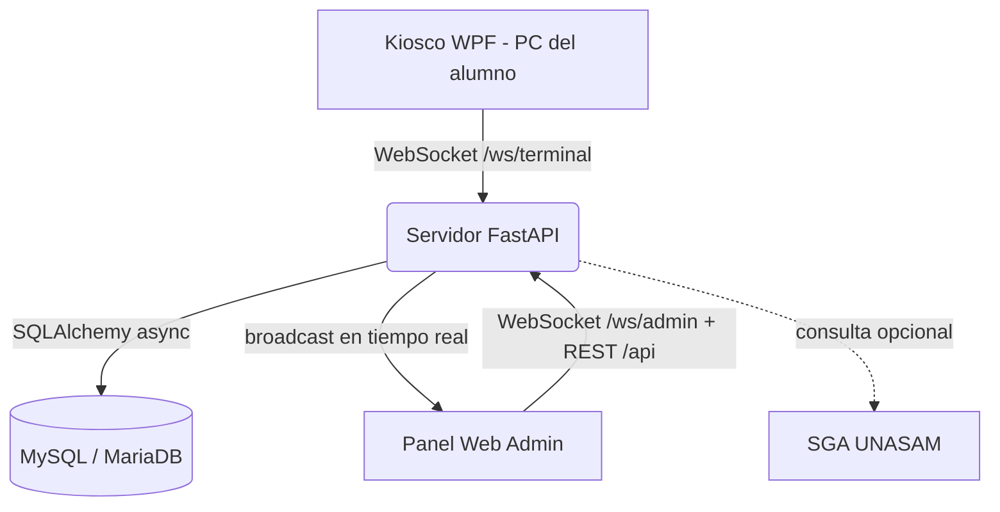
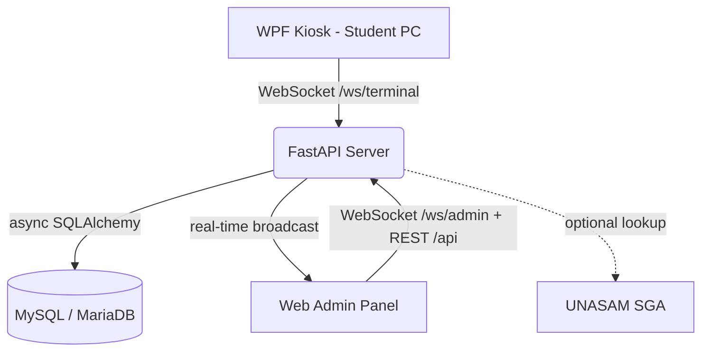

<div align="center">

# 🏫 Control de Acceso y Bloqueo de Terminales — Biblioteca UNASAM

**Sistema de control de las PCs de la Biblioteca Central / Centro de Cómputo de la UNASAM**
*(Universidad Nacional Santiago Antúnez de Mayolo — Huaraz, Perú)*

[](https://www.python.org/)
[](https://fastapi.tiangolo.com/)
[](https://learn.microsoft.com/dotnet/csharp/)
[](https://developer.mozilla.org/docs/Web/JavaScript)
[](https://mariadb.org/)

**Versión actual: 4.x** · **Idioma:** [🇵🇪 Español](#-español) · [🇺🇸 English](#-english)

</div>

---

# 🇵🇪 Español

## Tabla de Contenidos

1. [Qué es el sistema](#1-qué-es-el-sistema)
2. [Las tres partes](#2-las-tres-partes)
3. [Arquitectura en 30 segundos](#3-arquitectura-en-30-segundos)
4. [Conceptos clave](#4-conceptos-clave)
5. [Funcionalidades principales](#5-funcionalidades-principales)
6. [Base de datos](#6-base-de-datos)
7. [Roles: admin y superadmin](#7-roles-admin-y-superadmin)
8. [Instalación y despliegue](#8-instalación-y-despliegue)
9. [Estructura del proyecto](#9-estructura-del-proyecto)
10. [Documentación del proyecto](#10-documentación-del-proyecto)
11. [Solución de problemas](#11-solución-de-problemas)
12. [Estado del proyecto y seguridad](#12-estado-del-proyecto-y-seguridad)

---

## 1. Qué es el sistema

Controla el acceso a las computadoras de las bibliotecas / centros de cómputo de la UNASAM: **bloquea cada PC**, los alumnos la desbloquean ingresando su **DNI**, y el personal **monitorea y administra todo** desde un panel web.

Se instala de forma **independiente en cada lugar** (biblioteca central, otras facultades). Cada instalación tiene su propio servidor; nada de IPs está fijo en el código.

**Lo que hace, en concreto:**

- Bloquea físicamente cada PC hasta que un alumno registrado ingresa su DNI.
- Valida al alumno en tiempo real contra la base de datos local (con consulta opcional al SGA, que tiene respaldo en la base local).
- Registra cada sesión: quién usó qué PC, cuándo, por cuánto tiempo y con qué motivo.
- Monitorea la actividad del alumno (programas abiertos, descargas) y la clasifica en normal o sospechosa.
- Permite al personal banear alumnos, registrar incidencias, bloquear/apagar PCs y enviar mensajes a todas las terminales.
- Importa y exporta el padrón de alumnos y el historial desde/hacia Excel.
- Registra una **auditoría** de quién hizo cada acción administrativa.
- Funciona en **modo offline** de emergencia si el servidor no es alcanzable por red.

---

## 2. Las tres partes

| Parte | Tecnología | Dónde corre | Qué hace |
|-------|-----------|-------------|----------|
| **Servidor** | Python + FastAPI + WebSockets | PC del encargado de cada lugar | Orquesta todo: API REST, WebSockets, base de datos MySQL/MariaDB. |
| **Indicadores (KPIs y gráficos)**
- Tablero por pestañas: Equipos, Usuarios y Programas. KPIs personalizables por el superadmin.
- Gráficos de uso por facultad y de alumnos nuevos registrados, con período semana / mes / rango.
- **Ranking de programas más usados**, que incluye los aún sin clasificar para detectar software que conviene licenciar o asegurar.

**Banco de programas y banco de ruido**
- Lista blanca de aplicaciones reconocidas y catálogo de procesos de fondo.
- Lo que no está en ningún banco se marca **sospechoso** hasta que el superadmin lo clasifique (clasificación retroactiva).

**Cliente kiosco** | C# WPF (.NET 8) | Cada PC de uso de los alumnos | Bloquea la PC, pide DNI, monitorea actividad, se auto-actualiza. |
| **Panel admin** | HTML + JavaScript (vanilla) | Navegador, servido por el servidor | Monitoreo en vivo y control de las PCs. |

---

## 3. Arquitectura en 30 segundos


```mermaid
graph TD
    A[Kiosco WPF - PC del alumno] -- "WebSocket /ws/terminal" --> B(Servidor FastAPI)
    D[Panel Web Admin] -- "WebSocket /ws/admin + REST /api" --> B
    B -- "SQLAlchemy async" --> C[(MySQL / MariaDB)]
    B -- "broadcast en tiempo real" --> D
    B -. "consulta opcional" .-> E[SGA UNASAM]
```

- **Servidor (`server/`):** FastAPI + MySQL. Expone `/api/...` (REST) y `/ws/terminal`, `/ws/admin` (WebSockets). Sirve el panel en `/admin`. Config en `server/config.json` → genera `server/.env`.
- **Cliente kiosco (`client/`):** C# WPF. Bloquea la PC, se conecta por WebSocket, monitorea actividad, se auto-actualiza descargando el `.exe` nuevo. Config en `kiosco.config.json` (IP del servidor).
- **Panel admin (`admin/`):** HTML + JS. Se abre en `http://<servidor>:8000/admin/`. Se adapta solo a la IP del servidor (usa `window.location`).

---

## 4. Conceptos clave

| Concepto | Qué es |
|----------|--------|
| **Sesión** | Cuando un alumno desbloquea una PC con su DNI. Tiene estado (activa/cerrada) y se confirma para evitar "sesiones fantasma". |
| **Terminal / Nodo** | Una PC con el cliente kiosco instalado. |
| **Actividad** | Lo que hace el alumno (abrir programas, descargar). Se clasifica en "normal" o "sospechoso". |
| **Sospecha** | Alerta automática cuando se detecta actividad sospechosa (cambio rápido de PC, intento con DNI baneado, sesión muy larga). |
| **Incidencia** | Falta registrada contra un alumno (leve/grave). 3 leves o 1 grave → recomienda baneo. |
| **Ban** | Bloqueo de un DNI para que no pueda usar las PCs (por N días o indefinido). |
| **Proceso ignorado** | Ejecutable que el admin marca para no verlo en la lista de actividad (se sigue guardando, solo se oculta). |
| **Auditoría** | Bitácora inmutable de quién hizo cada acción administrativa y cuándo. |
| **Rol** | `admin` (operativo) o `superadmin` (acceso completo). |
| **Modo offline** | Desbloqueo de emergencia cuando el servidor no es alcanzable por red (el encargado autoriza con un atajo + PIN). |

---

## 5. Funcionalidades principales

**Monitoreo y control (pestaña Nodos)**
- Ver todas las PCs en tiempo real (activa / bloqueada / offline).
- Desbloquear manualmente una PC para un alumno, bloquear o apagar una PC, bloquear toda la sala.

**Historial**
- Buscar sesiones por alumno/fecha; exportar a **Excel** (todo) o **PDF** (con filtros); importar historial desde Excel (solo superadmin).

**Base de datos**
- Padrón de alumnos y personal: alta/edición/eliminación e **importar/exportar Excel**.
- **Vigencia de credenciales:** cada carnet tiene fecha de caducidad; el servidor **bloquea el acceso** de los vencidos y el panel permite renovarlos. Filtro "Solo vencidas" y columna de vigencia en el listado.

**Alertas**
- **Sospechas:** revisar y aprobar (crea incidencia) o descartar.
- **Incidencias:** registrar faltas; botón de baneo directo en incidencias graves.
- **Baneados:** banear/levantar ban; historial de bans (solo superadmin).

**Configuración**
- Cambiar credenciales; personalizar ícono y textos del login; gestionar el atajo/PIN del modo offline y mantenimiento; mensajes programados a las PCs; **backup SQL** de toda la base; **auditoría** de acciones.
- **Motivos de uso gestionables:** agregar, editar, desactivar o reactivar las razones que el alumno elige en la PC. Los cambios llegan a las terminales sin recompilar el cliente.

**Cliente kiosco**
- Bloqueo de teclado y pantalla completa; monitoreo de actividad; auto-actualización; reconexión automática; modo offline de emergencia.

---

## 6. Base de datos

**Motor:** MySQL / MariaDB (la base se llama `biblioteca_unasam`). El sistema **se niega a arrancar** si no apunta a MySQL — no usa SQLite. Las tablas se crean solas al arrancar (`create_all`); no hay que crearlas a mano.

**21 tablas:**

| Tabla | Qué guarda |
|-------|-----------|
| `alumnos_maestro` | Padrón de estudiantes, con vigencia del carnet (alta / caducidad / renovación). |
| `facultades` / `escuelas` | Catálogos académicos. |
| `terminales` | PCs registradas. |
| `catalogo_motivos` | Motivos de uso, gestionables desde el panel. |
| `sesiones` | Historial completo de accesos. |
| `usuarios` | Cuentas del panel (admin/superadmin). |
| `bans` | Baneos de alumnos (quién baneó/levantó y cuándo). |
| `incidencias` | Faltas registradas (leve/grave). |
| `sospechas` | Alertas automáticas de actividad. |
| `actividad_logs` | Actividad de los alumnos (programas, descargas). |
| `procesos_ignorados` | Ejecutables ocultados de la vista de actividad. |
| `personal_universidad` | Padrón de personal. |
| `configuracion_kiosco` | Atajos y PIN del backdoor/offline del kiosco. |
| `mensajes_programados` | Avisos programados a las PCs. |
| `auditoria` | Bitácora de acciones administrativas. |
| `banco_apps` | Programas reconocidos (lista blanca). |
| `banco_ruido` | Procesos de fondo que se ocultan del flujo. |
| `egresados` / `docentes` / `autoridades` | Otros padrones del centro de cómputo. |

> **Migración desde la v3.0:** la estructura cambió (nombres de tablas/columnas distintos). NO se restaura una base v3.0 sobre la nueva. La migración se hace exportando a Excel desde la v3.0 e importando en la versión nueva. Procedimiento paso a paso en [docs/INSTALACION_SERVIDOR.txt](docs/INSTALACION_SERVIDOR.txt), sección E.

---

## 7. Roles: admin y superadmin

| Acción | admin | superadmin |
|--------|:-----:|:----------:|
| Monitoreo en vivo, historial, exportar Excel/PDF | ✅ | ✅ |
| Bloquear / desbloquear / apagar PC, bloquear sala | ✅ | ✅ |
| Registrar incidencias, banear, gestionar sospechas | ✅ | ✅ |
| Importar/exportar alumnos y personal | ❌ | ✅ |
| Importar historial, backup SQL | ❌ | ✅ |
| Crear/editar usuarios del panel, cambiar config del kiosco | ❌ | ✅ |
| Ver auditoría e historial de bans | ❌ | ✅ |
| Reset de la base de datos | ❌ | ✅ |

Las acciones realmente sensibles exigen superadmin; las operativas del día a día las puede hacer cualquier rol. Toda acción administrativa queda en la **auditoría** con el usuario que la hizo.

---

## 8. Instalación y despliegue

> 📄 **Guía completa y paso a paso:** [docs/INSTALACION_SERVIDOR.txt](docs/INSTALACION_SERVIDOR.txt)
> (incluye el respaldo obligatorio y la migración de datos desde la v3.0).

### Requisitos
- **MySQL / MariaDB** (recomendado vía XAMPP), corriendo en el puerto 3306.
- **Python 3.11+** (marcar "Add Python to PATH" al instalar).
- IP fija para la PC del servidor en la red local.

### Instalación del servidor (resumen)
1. Editar `server/config.json` (contraseña de MySQL + IP fija de la PC).
2. Clic derecho en `server/instalar_servidor.bat` → **Ejecutar como administrador**.
   Crea el entorno virtual, instala dependencias, genera `.env` con una `SECRET_KEY` fuerte, crea la base de datos y las tablas, abre el puerto 8000 en el firewall y configura el arranque automático.
3. Reiniciar la PC (arranca solo) o ejecutar `server/servidor_run.bat`.
4. Entrar a `http://localhost:8000/admin` → usuario `superadmin`, contraseña inicial `admin123` → **cambiar la contraseña de inmediato**.

### Compilar y desplegar el cliente kiosco
```powershell
cd client
dotnet clean
dotnet publish -c Release -r win-x64 --self-contained true /p:PublishSingleFile=true -o publish\
```
Copiar el `.exe` resultante a `C:\WinSysCache\` y subir el número en `version.txt`. Los kioscos se auto-actualizan al reiniciarse.

---

## 9. Estructura del proyecto

```text
control/
├── server/                         # Backend Python / FastAPI
│   ├── main.py                     # App, WebSockets, lifespan, SGA, mensajes
│   ├── models.py                   # Modelos SQLAlchemy (16 tablas)
│   ├── database.py                 # Engine async + sesiones (solo MySQL)
│   ├── auth_service.py             # JWT, hash de contraseñas, dependencias de auth
│   ├── configurador.py             # Lee config.json → genera .env y crea la BD
│   ├── config.json                 # Config local (NO subir a git)
│   ├── requirements.txt            # Dependencias Python
│   ├── instalar_servidor.bat       # Instalador automático
│   ├── servidor_run.bat            # Arranca uvicorn
│   ├── api/
│   │   └── endpoints.py            # Endpoints REST (/api/...)
│   └── core/
│       ├── websocket_manager.py    # Gestión de conexiones WebSocket
│       ├── auditoria.py            # Helper de registro de auditoría
│       ├── rate_limit.py           # Rate limiting por IP
│       └── koha_connector.py       # Conector al SGA UNASAM
│
├── admin/                          # Panel web
│   ├── index.html                  # Interfaz completa
│   └── static/js/app.js            # Toda la lógica del panel
│
├── client/                         # Cliente kiosco C# / .NET 8
│   ├── UI/                         # MainWindow + ventanas (carga, desconexión, nombre PC)
│   └── Services/                   # WebSocket, hooks, seguridad, auto-update,
│                                   #   modo offline, backdoor, monitor de actividad
│
└── docs/                           # Documentación operativa (ver sección 10)
```

---

## 10. Documentación del proyecto

Toda la documentación viva está en [`docs/`](docs/) y en la raíz:

| Documento | Para qué sirve |
|-----------|----------------|
| [docs/INDICE.txt](docs/INDICE.txt) | Índice general de la documentación. |
| [docs/INSTALACION_SERVIDOR.txt](docs/INSTALACION_SERVIDOR.txt) | Cómo instalar el servidor en la PC del administrador + migración desde v3.0. |
| [docs/CASOS_DE_USO.txt](docs/CASOS_DE_USO.txt) | "¿Cómo hago X? ¿Qué debería pasar?" — guía operativa paso a paso. |
| [docs/CATALOGO_CASOS_DE_USO.txt](docs/CATALOGO_CASOS_DE_USO.txt) | Catálogo completo de los 100 casos de uso, agrupados por actor (alumno / admin / superadmin / sistema) con flujos verificados contra el código. **Base para el manual de usuario.** |
| [docs/FLUJO_ADMIN.txt](docs/FLUJO_ADMIN.txt) | Flujo del administrador en el panel. |
| [docs/FLUJO_ALUMNO.txt](docs/FLUJO_ALUMNO.txt) | Flujo del alumno en el kiosco. |
| [docs/PRUEBAS_EN_CAMPO.txt](docs/PRUEBAS_EN_CAMPO.txt) | Checklist de verificación presencial en la biblioteca. |
| [VULNERABILIDADES.txt](VULNERABILIDADES.txt) | Análisis de seguridad: estado de cada hallazgo (resuelto/pendiente) con cita de archivo:línea. |
| [MEJORAS.txt](MEJORAS.txt) | Mejoras propuestas, ordenadas por impacto. |
| [faltas.txt](faltas.txt) | Lista viva de lo que falta por hacer/resolver. |
| [PENDIENTES.txt](PENDIENTES.txt) | Lista operativa corta de pendientes. |

---

## 11. Solución de problemas

| Síntoma | Causa probable | Solución |
|---------|----------------|----------|
| El panel no carga / el servidor no arranca | MySQL apagado | Arrancar MySQL (XAMPP en verde) y reintentar. |
| `Can't connect to MySQL` en la consola | MySQL apagado o contraseña mal en config.json/.env | Arrancar MySQL; corregir credenciales y reejecutar el configurador. |
| `DATABASE_URL no configurado o no apunta a MySQL` | El `.env` no se generó o quedó mal | Reejecutar `instalar_servidor.bat` con MySQL corriendo. |
| `SECRET_KEY es débil o placeholder` | `.env` con clave inválida | Borrar el `.env` y reejecutar el configurador (genera una fuerte). |
| `Address already in use` (puerto 8000) | Ya hay un servidor corriendo | Cerrar el proceso `python.exe` anterior. |
| El kiosco dice "Desconectado" en rojo | No alcanza al servidor / firewall | Verificar IP del servidor, que el puerto 8000 esté abierto y la red local. |
| El panel no muestra los cambios nuevos | Caché del navegador | Recargar con **Ctrl+Shift+R**. |
| Olvidé la contraseña del superadmin | — | Ver [docs/CASOS_DE_USO.txt](docs/CASOS_DE_USO.txt) caso A-3 (se actualiza el hash en la BD). |

---

## 12. Estado del proyecto y seguridad

El sistema pasó por varios análisis de seguridad exhaustivos. El detalle completo (con estado resuelto/pendiente y cita de archivo:línea) está en [VULNERABILIDADES.txt](VULNERABILIDADES.txt).

**Resuelto:** autenticación JWT en WebSocket admin, rate limiting por IP, enmascarado de PII en logs, headers de seguridad HTTP, complejidad de contraseñas, validación de subidas, auditoría en base de datos, persistencia de sesión, y la corrección de bugs funcionales y del modo offline.

**Pendiente (requiere recompilar y probar en campo):** endurecimientos del cliente C# — verificación de firma/hash del `.exe` en la auto-actualización, comandos del servidor firmados / canal con TLS, y PIN del backdoor no hardcodeado. Ver [faltas.txt](faltas.txt) para la lista priorizada.

> **Nota de despliegue:** el sistema corre en red local (HTTP/WS sin TLS por diseño actual). No exponer el servidor a internet sin antes resolver los pendientes de cifrado del canal.

---
---

# 🇺🇸 English

## Table of Contents

1. [What it is](#1-what-it-is)
2. [The three parts](#2-the-three-parts)
3. [Architecture in 30 seconds](#3-architecture-in-30-seconds)
4. [Key concepts](#4-key-concepts)
5. [Main features](#5-main-features)
6. [Database](#6-database)
7. [Roles](#7-roles)
8. [Installation](#8-installation)
9. [Documentation](#9-documentation)
10. [Project status](#10-project-status)

---

## 1. What it is

This system controls access to the computers in UNASAM's libraries / computer centers: it **locks each PC**, students unlock it by entering their **DNI** (national ID), and staff **monitor and manage everything** from a web panel.

It is installed **independently at each location** (each install has its own server; no IPs are hardcoded).

**What it does:** physically locks each PC until a registered student enters their DNI; validates in real time against the local database (optional SGA lookup with local fallback); records every session (who, which PC, when, how long, why); monitors student activity and flags it normal/suspicious; lets staff ban students, log incidents, lock/shut down PCs and broadcast messages; imports/exports students and history via Excel; keeps an **audit log** of admin actions; and supports an emergency **offline mode** when the server is unreachable.

---

## 2. The three parts

| Part | Tech | Runs on | Role |
|------|------|---------|------|
| **Server** | Python + FastAPI + WebSockets | Staff PC at each site | Orchestrates everything: REST API, WebSockets, MySQL/MariaDB. |
| **Kiosk client** | C# WPF (.NET 8) | Each student PC | Locks the PC, asks for DNI, monitors activity, self-updates. |
| **Admin panel** | HTML + Vanilla JS | Browser, served by the server | Real-time monitoring and control. |

---

## 3. Architecture in 30 seconds


```mermaid
graph TD
    A[WPF Kiosk - Student PC] -- "WebSocket /ws/terminal" --> B(FastAPI Server)
    D[Web Admin Panel] -- "WebSocket /ws/admin + REST /api" --> B
    B -- "async SQLAlchemy" --> C[(MySQL / MariaDB)]
    B -- "real-time broadcast" --> D
    B -. "optional lookup" .-> E[UNASAM SGA]
```

- **Server (`server/`):** FastAPI + MySQL. Exposes `/api/...` (REST) and `/ws/terminal`, `/ws/admin` (WebSockets). Serves the panel at `/admin`. Config in `server/config.json` → generates `server/.env`.
- **Kiosk client (`client/`):** C# WPF. Locks the PC, connects via WebSocket, monitors activity, self-updates by downloading the new `.exe`.
- **Admin panel (`admin/`):** HTML + JS at `http://<server>:8000/admin/`. Auto-adapts to the server IP.

---

## 4. Key concepts

| Concept | Meaning |
|---------|---------|
| **Session** | When a student unlocks a PC with their DNI. Confirmed to avoid "ghost sessions". |
| **Terminal / Node** | A PC running the kiosk client. |
| **Activity** | What the student does (apps, downloads). Classified as normal or suspicious. |
| **Suspicion** | Automatic alert on suspicious activity (rapid PC switching, banned DNI attempt, overly long session). |
| **Incident** | A logged offense against a student (minor/serious). 3 minor or 1 serious → ban recommended. |
| **Ban** | Blocks a DNI from using the PCs. |
| **Ignored process** | An executable the admin hides from the activity view (still stored). |
| **Audit** | Immutable log of who did each admin action and when. |
| **Role** | `admin` (operational) or `superadmin` (full access). |
| **Offline mode** | Emergency unlock when the server is unreachable (staff authorize with a shortcut + PIN). |

---

## 5. Main features

- **Monitoring (Nodes tab):** real-time PC status; manual unlock, lock, shutdown, lock-all.
- **History:** search sessions, export Excel/PDF, import history (superadmin).
- **Database:** student/staff roster CRUD + Excel import/export.
- **Alerts:** suspicions (approve→incident / dismiss), incidents (with direct-ban on serious ones), bans (ban/lift + history for superadmin).
- **Configuration (superadmin):** credentials, login branding, offline/maintenance shortcut & PIN, scheduled messages, full SQL backup, audit log.
- **Kiosk:** keyboard lock + fullscreen, activity monitoring, self-update, auto-reconnect, emergency offline mode.

---

## 6. Database

**Engine:** MySQL / MariaDB (database `biblioteca_unasam`). The server **refuses to start** unless it points to MySQL — no SQLite. Tables are auto-created on startup (`create_all`). **16 tables:** students, faculties, schools, terminals, usage catalog, sessions, panel users, bans, incidents, suspicions, activity logs, ignored processes, university staff, kiosk config, scheduled messages, and audit.

> **Migrating from v3.0:** the schema changed (different table/column names). Do NOT restore a v3.0 backup over the new DB. Migrate by exporting to Excel from v3.0 and importing into the new version. Step-by-step in [docs/INSTALACION_SERVIDOR.txt](docs/INSTALACION_SERVIDOR.txt) (section E — Spanish).

---

## 7. Roles

Operational actions (monitoring, lock/unlock/shutdown, incidents, bans) are available to **both** `admin` and `superadmin`. Sensitive actions (import/export, SQL backup, user management, kiosk config, audit, DB reset) require **superadmin**. Every admin action is recorded in the **audit log** with the acting user.

---

## 8. Installation

Full step-by-step guide (Spanish): [docs/INSTALACION_SERVIDOR.txt](docs/INSTALACION_SERVIDOR.txt).

**Requirements:** MySQL/MariaDB (XAMPP), Python 3.11+, a fixed local IP for the server.

**Server (summary):** edit `server/config.json` → run `server/instalar_servidor.bat` as Administrator (creates venv, installs deps, generates `.env`, creates the DB and tables, opens port 8000, sets auto-start) → open `http://localhost:8000/admin` (`superadmin` / `admin123`, change it immediately).

**Build the kiosk client:**
```powershell
cd client
dotnet clean
dotnet publish -c Release -r win-x64 --self-contained true /p:PublishSingleFile=true -o publish\
```
Copy the `.exe` to `C:\WinSysCache\` and bump `version.txt`. Kiosks self-update on restart.

---

## 9. Documentation

Living documentation lives in [`docs/`](docs/) and the repo root: installation guide, use cases, admin/student flows, field-test checklist, security analysis (`VULNERABILIDADES.txt`), proposed improvements (`MEJORAS.txt`), and the pending-work list (`faltas.txt`). See section 10 of the Spanish part for the full table with links.

---

## 10. Project status

The system went through several thorough security reviews (details in [VULNERABILIDADES.txt](VULNERABILIDADES.txt)). **Resolved:** WebSocket admin JWT auth, per-IP rate limiting, PII masking in logs, HTTP security headers, password complexity, upload validation, database audit log, session persistence, and functional/offline-mode bug fixes. **Pending (needs client recompile + field testing):** C# client hardening — `.exe` signature/hash verification on auto-update, signed commands / TLS channel, and non-hardcoded backdoor PIN. See [faltas.txt](faltas.txt).

> **Deployment note:** runs on a local network (HTTP/WS without TLS by current design). Do not expose the server to the internet before resolving the channel-encryption items.

---

<div align="center">

**🇵🇪 Desarrollado para la UNASAM — Huaraz, Perú**

[⬆ Volver al inicio / Back to top](#-control-de-acceso-y-bloqueo-de-terminales--biblioteca-unasam)

</div>
